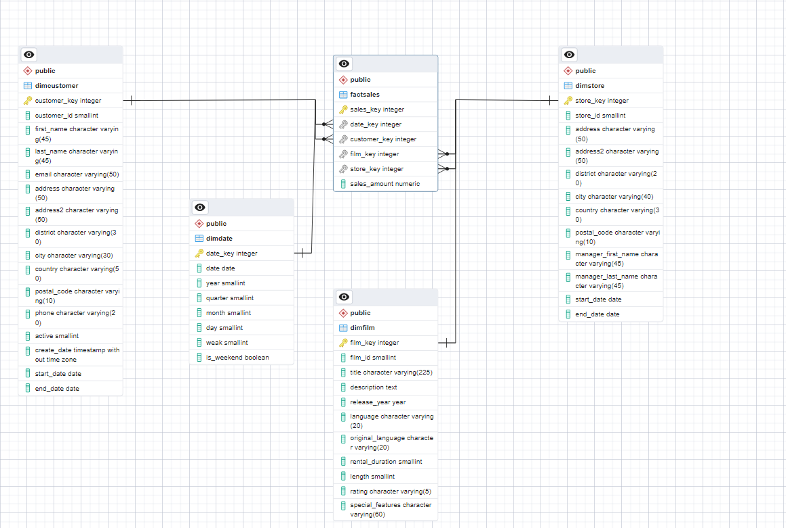

# Movie Rental Data Mart using Postgres 


### Overview

The goal of this project is to build a data mart or warehouse for a movie rental operational database in PostgreSQL. The data mart/warehouse is designed to facilitate analytical queries and reporting on the movie rental business.

### Features 

- Developed sql queries to denormalize tables from operational database and transform data for dimensional model .
- built dimensional model to facilitate analysis and reporting . 
- python script to execute all queries required to build data mart .

### Technolgies & Tools used

* PostgreSQL Database
* Python 
* psycopg2 library 
	


### Usage
Run the ETL process using the following command:
```bash
python Script.py
```


### Screenshot



